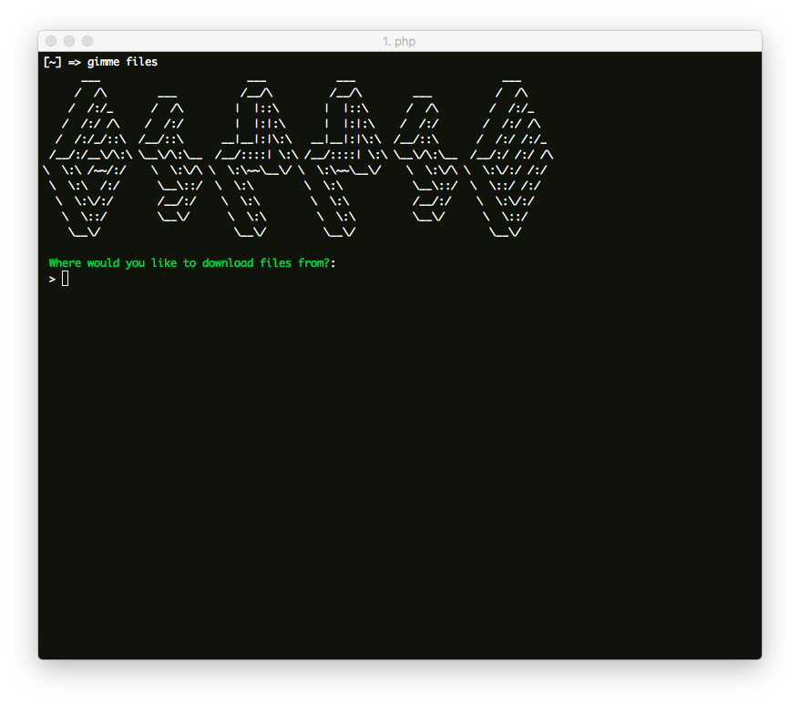

# Gimme



A simple PHP command line tool to download files of a specified type from a specified location.

## Installation

### via Composer

```
composer global require gimme/gimme:dev-master
```

Be sure `$HOME/.composer/vendor/bin` is in your $PATH. This exposes the `gimme` executable.

## Run

After you've gotten Gimme installed, you can run it like so:

```
gimme files
```

## Options

```
gimme files --include-size=true         // Include total combined size for all files, can be slow with a large number of files.
```

## Contribute

Contributors are very welcome. I made this tool so I wouldn't have to download PDF's individually, but it could be smarter and more powerful. If you have improvements, bug fixes, etc. just send a pull request!